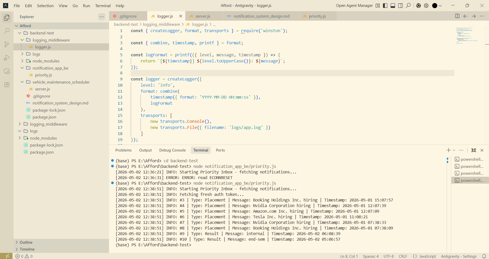

# Backend Evaluation Submission

## 👩‍💻 Overview

This project implements:

* Vehicle Maintenance Scheduler API (Knapsack Algorithm)
* Notification Priority System
* Logging Middleware using Winston
* System Design (notification_system_design.md)

---

## 🚀 Features

### 1. Vehicle Maintenance Scheduler

* Endpoint: `GET /schedule`
* Uses Knapsack algorithm to maximize impact within mechanic hours
* Fetches data from external APIs
* Logs all requests using middleware

---

### 2. Priority Notification System

* Fetches notifications from API
* Prioritizes using:

  * Type weight → Placement > Result > Event
  * Recency (timestamp)
* Returns Top 10 notifications

---

### 3. Logging Middleware

* Implemented using **Winston**
* Logs:

  * API requests
  * Response status
  * Execution time

---

## 🛠️ Tech Stack

* Node.js
* Express.js
* Axios
* Winston Logger

---

## 📸 Screenshots

### 🔹 Scheduler API Response



---

### 🔹 Priority Notification Output


---

## 📁 Project Structure

```
backend-test/
│
├── logging_middleware/
│   └── logger.js
│
├── vehicle_maintenance_scheduler/
│   └── server.js
│
├── notification_app_be/
│   └── priority.js
│
├── ss/
│   ├── pic 1.png
│   └── pic 2.png
│
├── notification_system_design.md
├── README.md
└── .gitignore
```

---

## ⚠️ Notes

* Token-based authentication used for external APIs
* Some APIs may fail due to server/network instability
* Error handling and logging are implemented

---

## ✅ Status

* Scheduler API: Implemented
* Priority System: Implemented
* Logging Middleware: Integrated
* System Design: Completed

---
